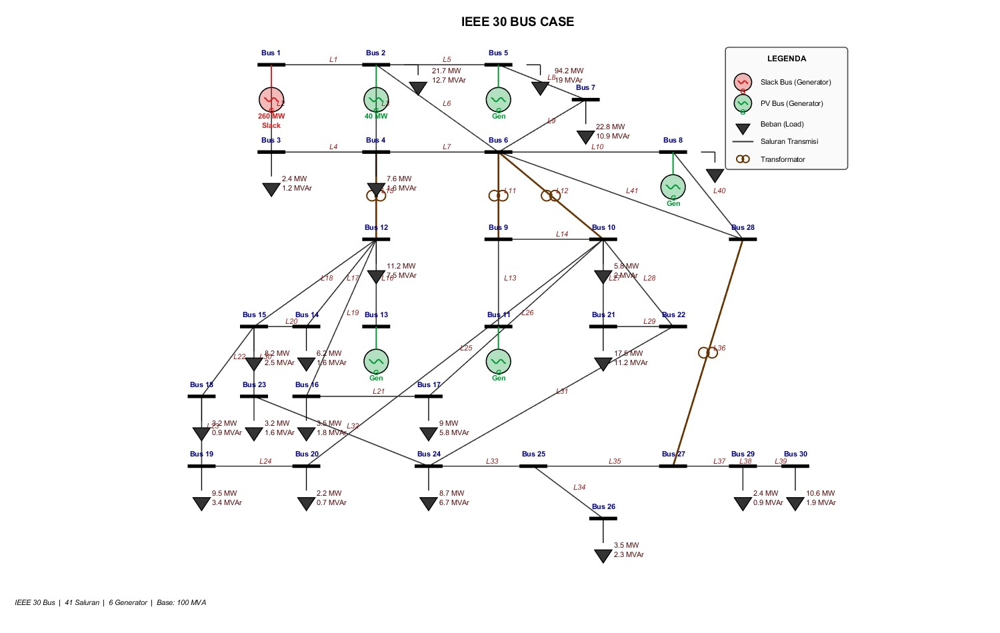

# IEEE 30-Bus Case

This folder contains MATLAB data and scripts for power flow simulation and N-1 contingency analysis on the IEEE 30-bus test system. The main dataset refers to the classic IEEE 30-bus system with a 100 MVA base, 30 buses, 41 transmission lines, and 6 generator buses.

## System Overview

- Test system: IEEE 30-bus
- Power base: 100 MVA
- Number of buses: 30
- Number of transmission lines: 41
- Number of generators: 6
- Slack bus: Bus 1
- PV/generator buses: Bus 1, 2, 5, 8, 11, and 13
- Power flow method: Newton-Raphson
- Slack allocation scheme: Distributed Slack Bus

## IEEE 30-Bus Diagram

<p align="center">
  
</p>

## File Structure

| File | Description |
| --- | --- |
| `data_ieee30bus.m` | Main IEEE 30-bus data: bus, line, and generator data. |
| `bentuk_ybus.m` | Function for building the network admittance matrix or Y-Bus. |
| `newton_raphson_pf.m` | Power flow function using the Newton-Raphson method. |
| `distributed_slack_bus.m` | Power flow function with slack distributed among generators based on Pmax capacity. |
| `main_simulasi.m` | Main script for running the base case and N-1 contingency analysis. |
| `topologi_ieee30bus_v2.m` | Script for generating the IEEE 30-bus single-line diagram. |
| `topologi_ieee30bus_v2.pdf` | Generated topology diagram in PDF format. |
| `topologi_ieee30bus_v2.png` | Generated topology diagram in PNG format. |
| `matlab_vs_matpower.md` | Notes comparing the standalone MATLAB implementation with MATPOWER. |
| `log_command_window_matlab.md` | MATLAB Command Window output log. |
| `*.png` | Simulation and analysis result figures. |

## Main Dataset

The main dataset is stored in:

```matlab
data_ieee30bus.m
```

The function returns three matrices:

```matlab
[busdata, linedata, gendata] = data_ieee30bus();
```

### `busdata` Format

```text
[Bus_No  Type  Pd(MW)  Qd(MVAr)  Vm(p.u.)  Va(deg)]
```

Bus type definition:

- `1` = Slack bus
- `2` = PV bus / generator bus
- `3` = PQ bus / load bus

### `linedata` Format

```text
[From  To  R(p.u.)  X(p.u.)  B/2(p.u.)  Tap_Ratio]
```

Notes:

- `R` and `X` are line impedance values in p.u.
- `B/2` is the half line charging susceptance.
- `Tap_Ratio = 0` is treated as a regular line with an effective tap ratio of `1`.
- Transformer tap branches are located on `6-9`, `6-10`, `4-12`, and `28-27`.

### `gendata` Format

```text
[Bus_No  Pg(MW)  Qg(MVAr)  Qmax  Qmin  Pmax  Pmin]
```

The generator data is used for Distributed Slack Bus allocation based on the maximum active power capacity `Pmax`.

## How to Run the Simulation

Open MATLAB, change the current directory to this folder, then run:

```matlab
main_simulasi
```

The main script performs:

1. Loading the IEEE 30-bus data.
2. Building the Y-Bus matrix.
3. Running the base-case power flow using the Distributed Slack Bus method.
4. Running N-1 contingency analysis by removing each transmission line one at a time.
5. Ranking contingencies based on the Performance Index.
6. Generating simulation result figures.


## Topology Diagram Generation

To regenerate the IEEE 30-bus single-line diagram, run:

```matlab
topologi_ieee30bus_v2
```

This script generates a power engineering style diagram with busbars, generators, transformers, loads, and transmission lines.

## Standard Data Notes

The data in this folder follows the common characteristics of the standard IEEE 30-bus test system: 30 buses, 41 transmission lines, 6 generators, and a 100 MVA base. However, the files are not written directly in MATPOWER case format. The data has been reorganized into a standalone MATLAB format so it can be processed by `bentuk_ybus`, `newton_raphson_pf`, and `distributed_slack_bus`.

Therefore, this dataset can be described as being based on the standard IEEE 30-bus test system, while the implementation format is a local MATLAB format prepared for research simulation purposes.

## Suggested Report Statement

The following sentence can be used in a report or thesis:

```text
The system data used in this study refers to the standard IEEE 30-bus test system with a 100 MVA power base, consisting of 30 buses, 41 transmission lines, and 6 generating units. The data is arranged in a standalone MATLAB format for power flow simulation and N-1 contingency analysis.
```

